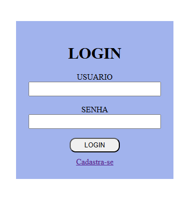
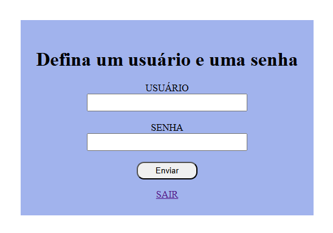
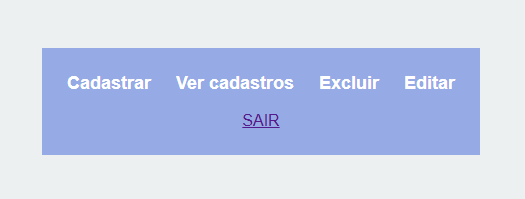
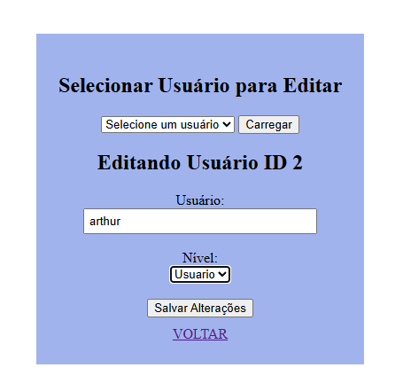

## 🚀 Sobre o Projeto

Este projeto foi desenvolvido com o objetivo de praticar conceitos fundamentais de desenvolvimento backend, incluindo:

- Autenticação de usuários
- Controle de sessão
- Controle de nível de acesso (admin e usuário comum)
- Operações CRUD (Create, Read, Update, Delete)
- Organização de estrutura de projeto
- Conexão com banco de dados PostgreSQL usando PDO

---

## 🛠 Tecnologias Utilizadas

- PHP (Programação Backend)
- PostgreSQL (Banco de Dados)
- HTML5
- CSS3
- PDO (PHP Data Objects)

---

## 🔑 Funcionalidades

✔ Cadastro de usuários  
✔ Login com validação  
✔ Logout com destruição de sessão  
✔ Controle de nível de acesso  
✔ Proteção de rotas  
✔ Listagem de usuários  
✔ Edição de dados  
✔ Exclusão de usuários  

## 📸 Demonstração do Sistema

### 🔐 Tela de Login

### 📝 Tela de Cadastro

### 📊 Dashboard Administrativo

### 📊 funções Administrativas
Edição de Usuário
Permite alterar informações de um usuário já cadastrado.

---

 Exclusão de Usuário
Permite remover usuários do sistema com controle administrativo.

---

Listagem de Usuários
Tela responsável por exibir todos os usuários cadastrados no sistema.

---

## 👨‍💻 Autor

Desenvolvido por **Arthur Vitor**